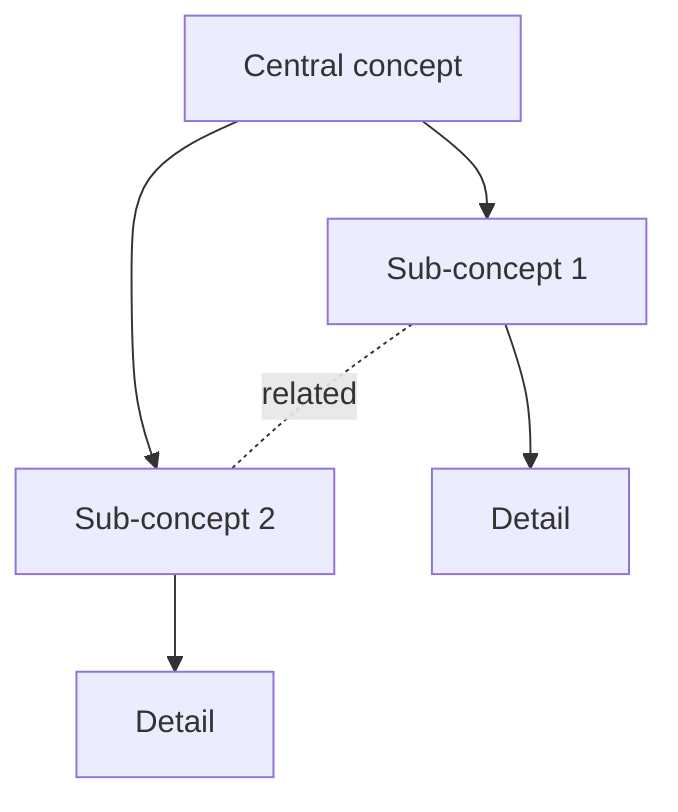

# Concept map: {{TOPIC_TITLE}}

**Legend:** solid arrows = direct dependency, dotted lines = related.

## Linked pages

- Central: [[wiki/pages/{{TOPIC}}]]
- Sub-concepts: [[wiki/pages/...]]

## Notes

- Update when new concepts emerge.
- If the map grows past ~12 nodes, split into two views.
