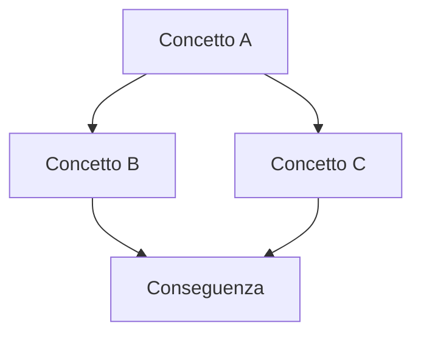

# View di esempio — concept map

**Riassunto**: una o due righe che spiegano l'angolazione di questa view.

**Fonti**: vedi `based_on` nel frontmatter + citazioni nelle note di lettura.

**Ultimo aggiornamento**: 2026-05-21.

---

## Mappa

## Note di lettura

- Il legame A → B emerge da [[_example-page]] (fonte: `raw/papers/esempio.pdf`).
- La convergenza su D è una sintesi — da verificare con altre fonti.

## Pagine collegate

- [[_example-page]]

<!--
Template. Mermaid è il formato preferito per concept-map, timeline e flow.
shareable: false → la view è viva, può essere rigenerata.
shareable: true → congelata, l'agente non la modifica più.
-->
